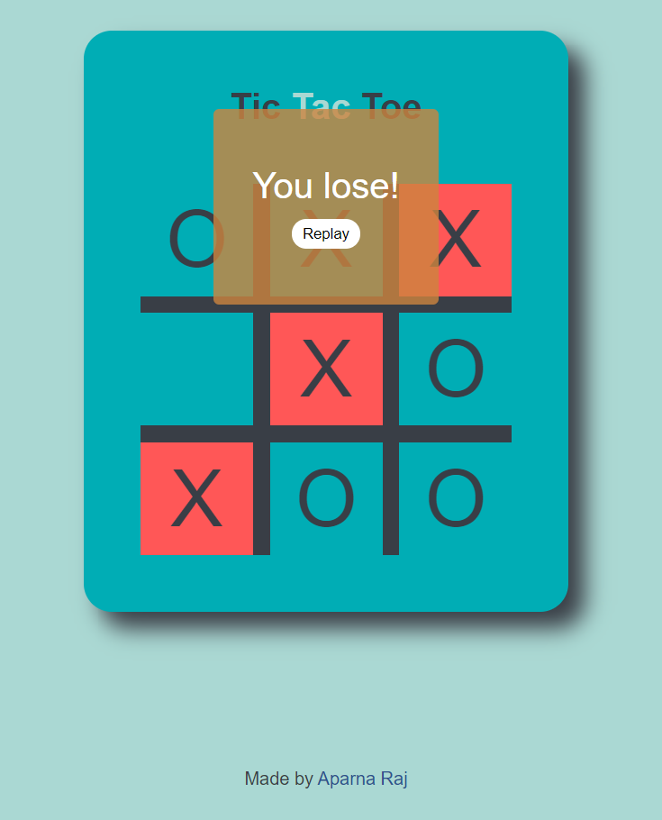

# Unbeatable Tic-Tac-Toe
The Tic Tac Toe game is a game for two players, who take turns marking the spaces in a 3×3 grid. The player who succeeded in placing three respective marks in a row, column, or a diagonal wins the game. 

This specific Tic-Tac-Toe however is AI based and is an unbeatable one! It uses Minimax Algorithm which sees a few steps ahead and puts itself in the shoes of its opponent. It keeps playing ahead until it reaches a terminal arrangement of the board (terminal state) resulting in a tie, a win, or a loss. Once in a terminal state, the AI will assign an arbitrary positive score (+10) for a win, a negative score (-10) for a loss, or a neutral score (0) for a tie.

At the same time, the algorithm evaluates the moves that lead to a terminal state based on the players’ turn. It will choose the move with maximum score when it is the AI’s turn and choose the move with the minimum score when it is the human player’s turn. Using this strategy, Minimax avoids AI losing to the human player.

### Deployment
Deployed Website: https://aparnaraj23.github.io/Unbeatable-Tic-Tac-Toe/

